## 记录
项目需要改处理器中的结构，为了学习chisel和硬件设计，学习ysyx课程

### F2
以前玩过一点，为了更好熟悉，依照讲义需求，布置下面任务：

搭建一个组合逻辑电路，输入是一个四位数ABCD，解码得到正确的数码管表示

我们列一下真值表
```
 a
f b
 g
e c
 d

十进制  A B C D   a b c d e f g
0      0 0 0 0   1 1 1 1 1 1 0
1      0 0 0 1   0 1 1 0 0 0 0
2      0 0 1 0   1 1 0 1 1 0 1
3      0 0 1 1   1 1 1 1 0 0 1
4      0 1 0 0   0 1 1 0 0 1 1
5      0 1 0 1   1 0 1 1 0 1 1
6      0 1 1 0   1 0 1 1 1 1 1
7      0 1 1 1   1 1 1 0 0 0 0
8      1 0 0 0   1 1 1 1 1 1 1
9      1 0 0 1   1 1 1 1 0 1 1
无效码 1 0 1 0   0 0 0 0 0 0 0
       1 0 1 1   0 0 0 0 0 0 0
       1 1 0 0   0 0 0 0 0 0 0
       1 1 0 1   0 0 0 0 0 0 0
       1 1 1 0   0 0 0 0 0 0 0
       1 1 1 1   0 0 0 0 0 0 0
```
最方便的方式应该就是用ROM来做，这样可以避免冗长的组合门逻辑

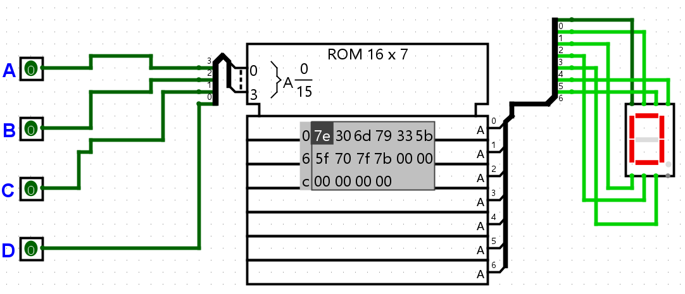
### F3
门电路：AB同时为非则通电，故$Y=\bar{A}\bar{B}$

或门逻辑：A+B = Y，因此Vcc侧是两个N门并联，地面侧是两个P门串联

晶体管数目：前者是10个，一个与门一个与非门，如果我们直接用CMOS构造与门，则应该是8个，后者是6个

异或门，在这个设计中一共有4+4+6+6+4=24个，当然也可以用CMOS直接构造与门，这样会少两个门

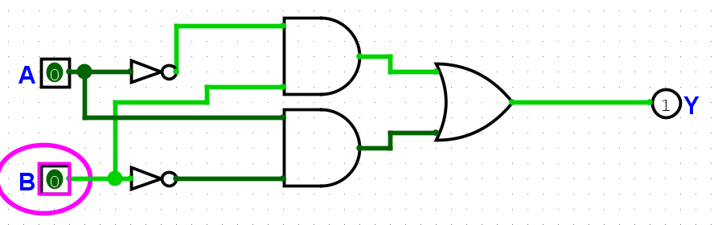

异或门的搭建我用了14个门，正好是同或门取反，因此后续同或门我就不再写半定制方案，这边对于这个CMOS管，比较坑的一点是这边的指向应该就是电流的指向
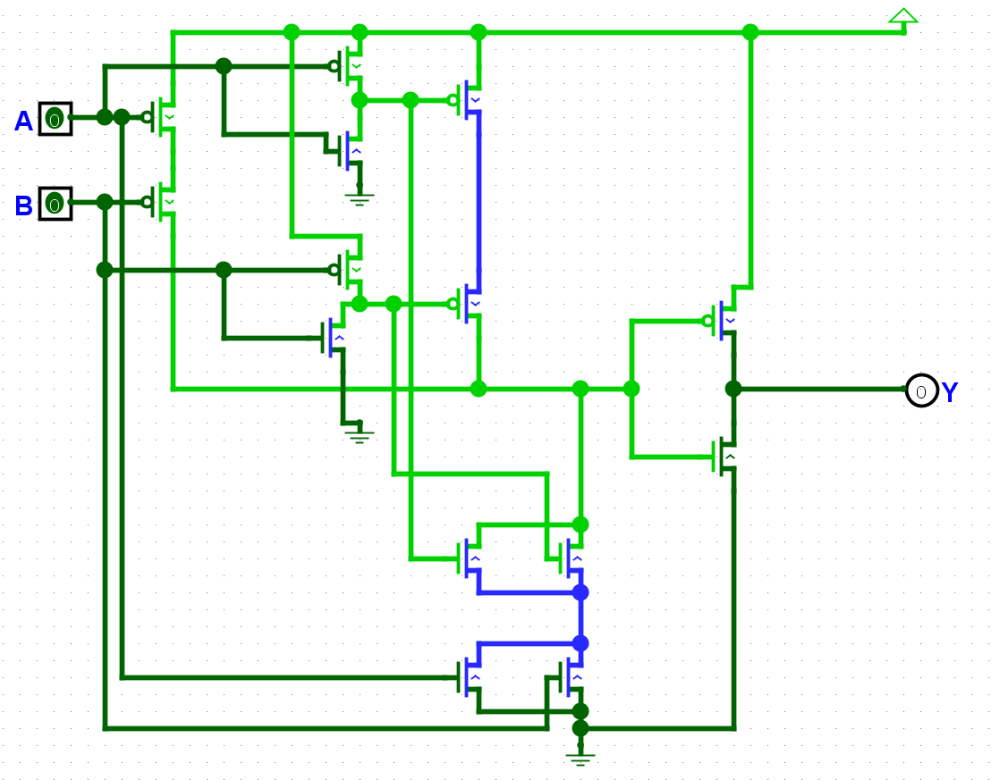

异或全定制电路的分析：我觉得讲义里头这个电路是错的，仿真失败，难怪我感觉N门这边的逻辑一直没有看懂

全定制电路的同或门实现：我们整不出来，本来依照讲义里头的示例修改着做，可能还可以考虑一下，应该也是错的，跳过

anyway，5v以下电路没有必要搞成这样，就这样吧

3-8译码器的构造，我们需要打一个真值表出来
```
输入      输出                                  现有板子
A2 A1 A0  Y7 Y6 Y5 Y4 Y3 Y2 Y1 Y0    X7 X6 X5 X4 X3 X2 X1 X0
0  0  0   0  0  0  0  0  0  0  1     0  0  0  1  0  0  0  1
0  0  1   0  0  0  0  0  0  1  0     0  0  0  1  0  0  1  0
0  1  0   0  0  0  0  0  1  0  0     0  0  0  1  0  1  0  0
0  1  1   0  0  0  0  1  0  0  0     0  0  0  1  1  0  0  0
1  0  0   0  0  0  1  0  0  0  0     0  0  1  0  0  0  0  1
1  0  1   0  0  1  0  0  0  0  0     0  0  1  0  0  0  1  0
1  1  0   0  1  0  0  0  0  0  0     0  0  1  0  0  1  0  0
1  1  1   1  0  0  0  0  0  0  0     0  0  1  0  1  0  0  0

Y0 = X4 & X0
Y1 = X4 & X1
Y2 = X4 & X2
Y3 = X4 & X3
Y4 = X5 & X0
Y5 = X5 & X1
Y6 = X5 & X2
Y7 = X5 & X3
```
于是我们可以得到


使用译码器来做这个数码管，我们先生成独热码，然后再进行或操作
```
十进制           a b c d e f g
0      0 0 0 0   1 1 1 1 1 1 0
1      0 0 0 1   0 1 1 0 0 0 0
2      0 0 1 0   1 1 0 1 1 0 1
3      0 0 1 1   1 1 1 1 0 0 1
4      0 1 0 0   0 1 1 0 0 1 1
5      0 1 0 1   1 0 1 1 0 1 1
6      0 1 1 0   1 0 1 1 1 1 1
7      0 1 1 1   1 1 1 0 0 0 0
8      1 0 0 0   1 1 1 1 1 1 1
9      1 0 0 1   1 1 1 1 0 1 1
       1 0 1 0   0 0 0 0 0 0 0
       1 0 1 1   0 0 0 0 0 0 0
       1 1 0 0   0 0 0 0 0 0 0
       1 1 0 1   0 0 0 0 0 0 0
       1 1 1 0   0 0 0 0 0 0 0
       1 1 1 1   0 0 0 0 0 0 0
```
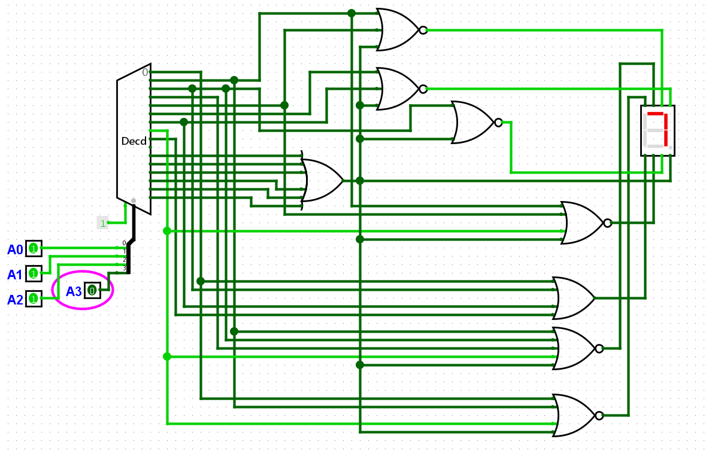

进一步完成十六进制的全部表示，修改真值表
```
十进制           a b c d e f g
0      0 0 0 0   1 1 1 1 1 1 0
1      0 0 0 1   0 1 1 0 0 0 0
2      0 0 1 0   1 1 0 1 1 0 1
3      0 0 1 1   1 1 1 1 0 0 1
4      0 1 0 0   0 1 1 0 0 1 1
5      0 1 0 1   1 0 1 1 0 1 1
6      0 1 1 0   1 0 1 1 1 1 1
7      0 1 1 1   1 1 1 0 0 0 0
8      1 0 0 0   1 1 1 1 1 1 1
9      1 0 0 1   1 1 1 1 0 1 1
A      1 0 1 0   1 1 1 0 1 1 1
b      1 0 1 1   0 0 1 1 1 1 1
C      1 1 0 0   1 0 0 1 1 1 0
d      1 1 0 1   0 1 1 1 1 0 1
E      1 1 1 0   1 0 0 1 1 1 1
F      1 1 1 1   1 0 0 0 1 1 1
```
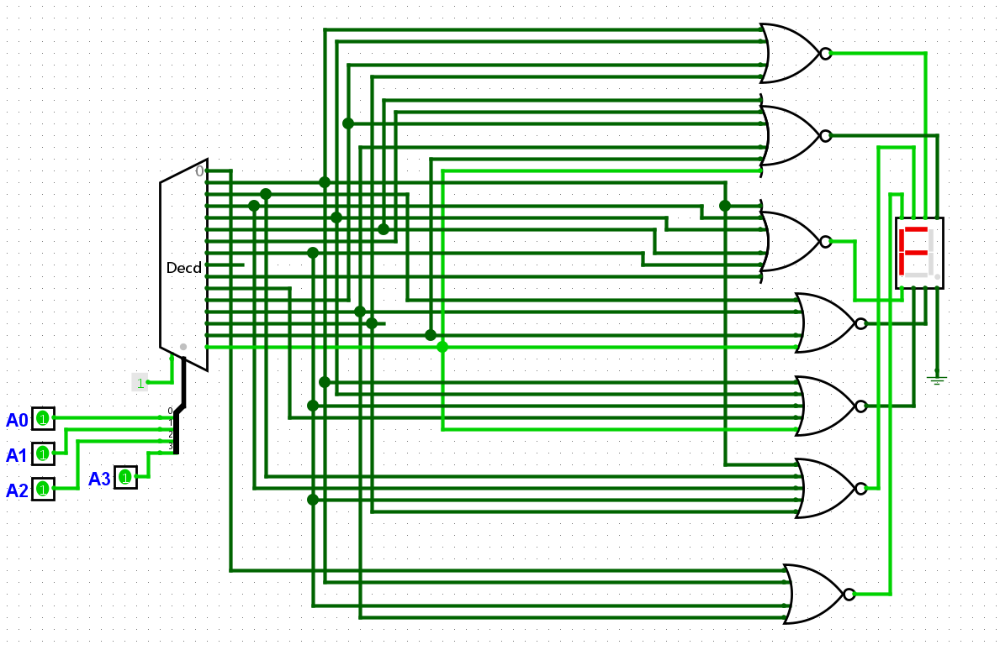

编码器的真值表
```
I₁₅ I₁₄ I₁₃ I₁₂ I₁₁ I₁₀ I₉ I₈ I₇ I₆ I₅ I₄ I₃ I₂ I₁ I₀ →       Y₃ Y₂ Y₁ Y₀
0   0   0   0   0   0   0   0   0   0   0   0   0   0   0   1  → 0 0 0 0
0   0   0   0   0   0   0   0   0   0   0   0   0   0   1   0  → 0 0 0 1
0   0   0   0   0   0   0   0   0   0   0   0   0   1   0   0  → 0 0 1 0
0   0   0   0   0   0   0   0   0   0   0   0   1   0   0   0  → 0 0 1 1
0   0   0   0   0   0   0   0   0   0   0   1   0   0   0   0  → 0 1 0 0
0   0   0   0   0   0   0   0   0   0   1   0   0   0   0   0  → 0 1 0 1
0   0   0   0   0   0   0   0   0   1   0   0   0   0   0   0  → 0 1 1 0
0   0   0   0   0   0   0   0   1   0   0   0   0   0   0   0  → 0 1 1 1
0   0   0   0   0   0   0   1   0   0   0   0   0   0   0   0  → 1 0 0 0
0   0   0   0   0   0   1   0   0   0   0   0   0   0   0   0  → 1 0 0 1
0   0   0   0   0   1   0   0   0   0   0   0   0   0   0   0  → 1 0 1 0
0   0   0   0   1   0   0   0   0   0   0   0   0   0   0   0  → 1 0 1 1
0   0   0   1   0   0   0   0   0   0   0   0   0   0   0   0  → 1 1 0 0
0   0   1   0   0   0   0   0   0   0   0   0   0   0   0   0  → 1 1 0 1
0   1   0   0   0   0   0   0   0   0   0   0   0   0   0   0  → 1 1 1 0
1   0   0   0   0   0   0   0   0   0   0   0   0   0   0   0  → 1 1 1 1
```

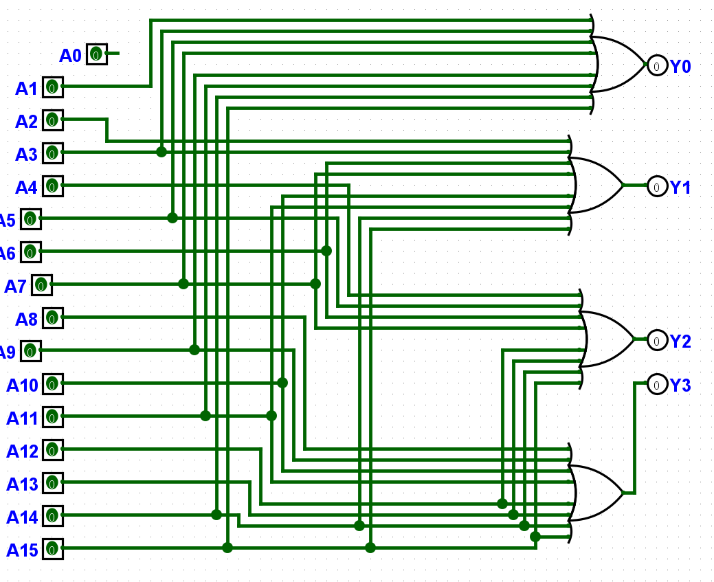

之后和上面做的东西联立一下就行

4-2优先编码器

$Y_0 = \bar{A_2}A_1 + A_3, Y_1 = A_2 + A_3$
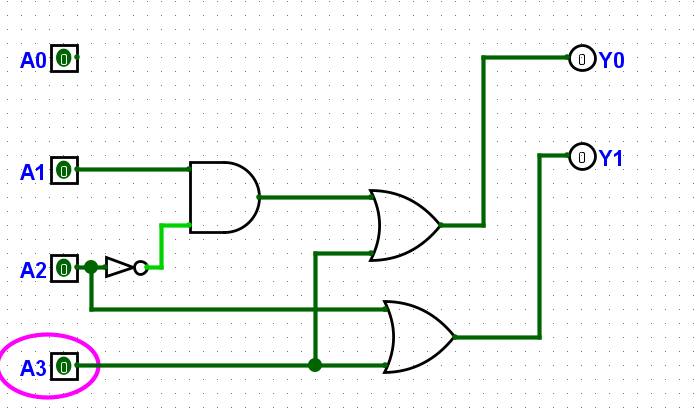

会比4-2 encoder多一个门

16-4的组成是一个体力活，首先我们得尝试做一个8-3，然后再把他们两个拼起来

用逻辑式子不大好，最好直接考虑选通这件事情，这样问题就很好解决了！

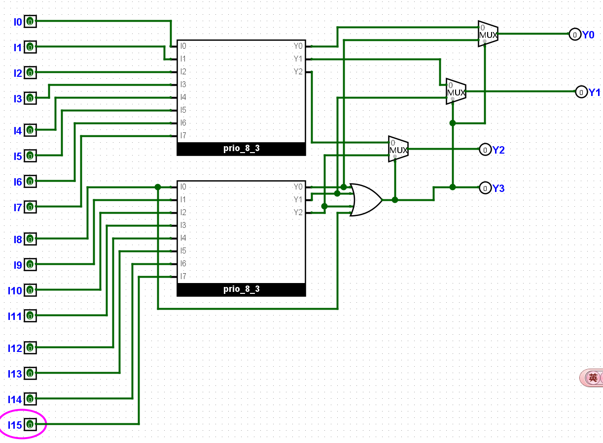

2选1选择器

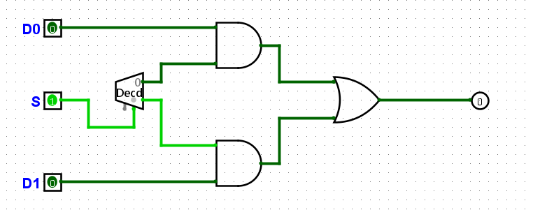

3位4选1选择器

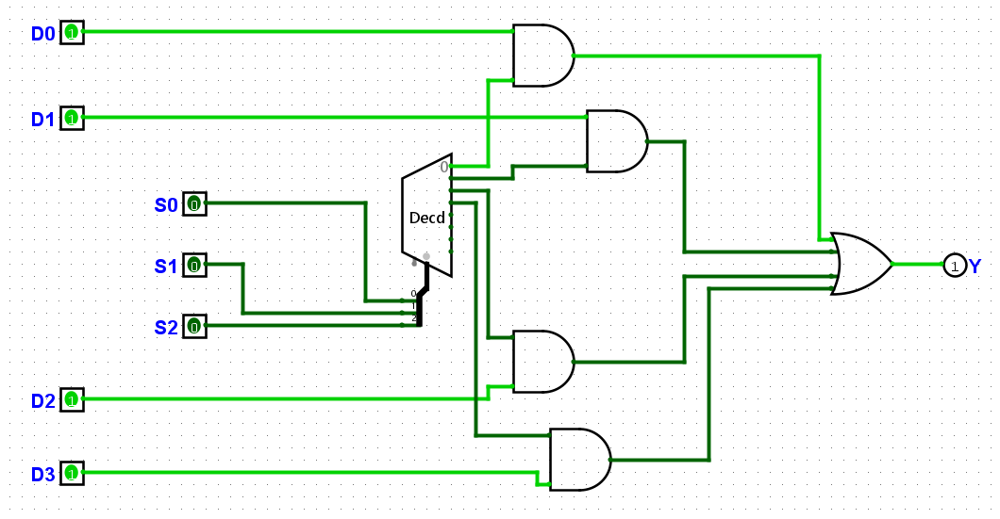

七段数码管选择器

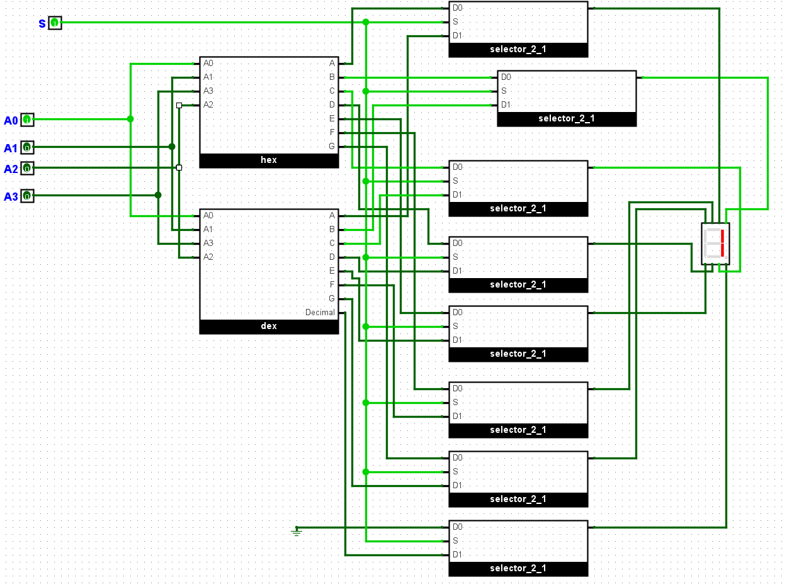

全加器

这边需要在A，B，Cin, S, Cout
```
A B Cin S Cout
0 0  0  0   0
0 0  1  1   0
0 1  0  1   0
0 1  1  0   1
1 0  0  1   0
1 0  1  0   1
1 1  0  0   1
1 1  1  1   1
```
$Cout = BCin + ACin + AB$

$S = ABCin + \bar{A}\bar{B}{Cin} + A\bar{B}\bar{Cin} + \bar{A}B\bar{Cin}$

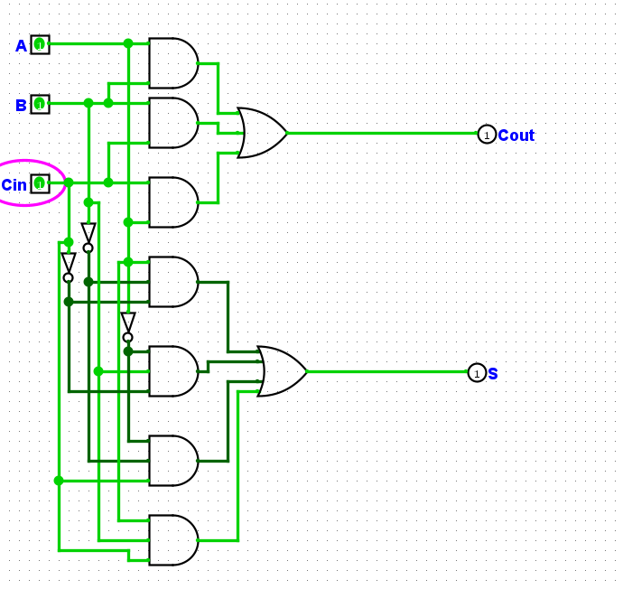

使用半加器也能得到全加器

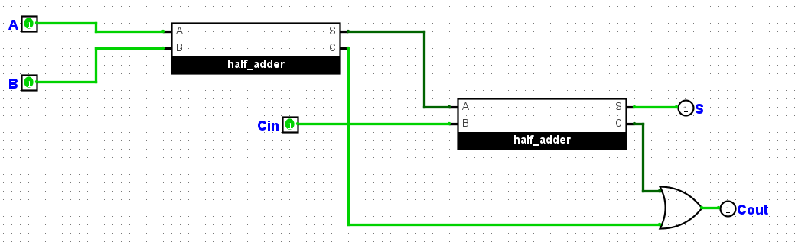

四位全加器

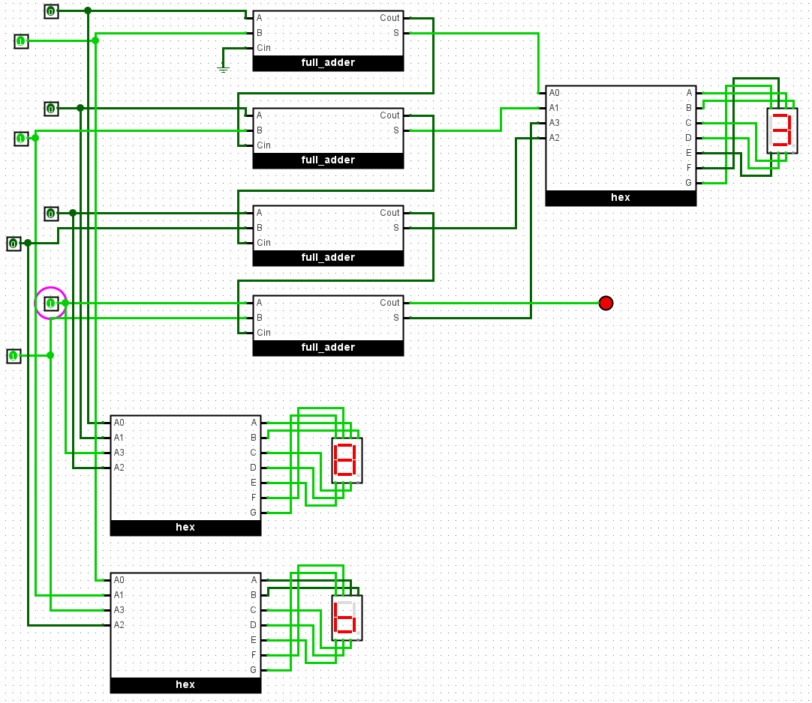

四位全减器，我们主要是基于了下面的观察

$\{0, a\} - \{0, b\} = \{0, a\} + \{1, \bar{b}\} + 1 = {1 + Cout, a + \bar{b} + 1}$

我们按照上述方式其实就可以我们做出来减法器了，是否借位，看最后一级别的LED是否为1就能知道了，此处的Cout反映的是1+Cout，因此如果真借位了，最后取反后可以得到的是1

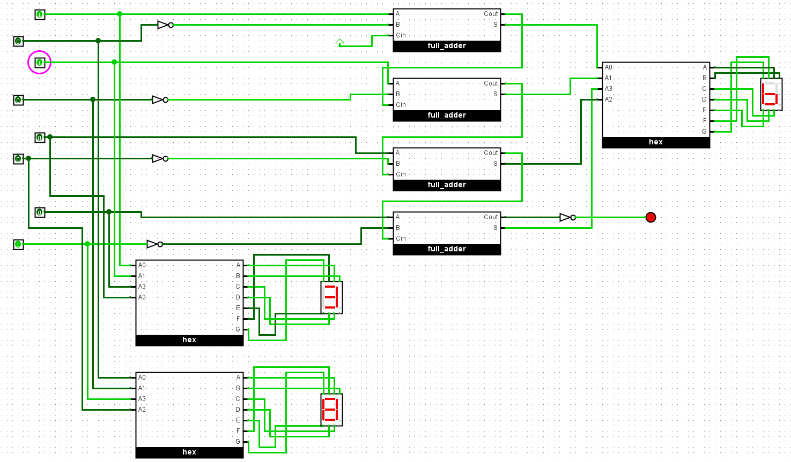

四位原码加法器
- 首先需要通过最高位判断其正负情况
- 如果都为正或者都为负，则直接进行相加
- 如果一个为正，一个为负，那么要对为负的做好取反加一工作，而为正的保持不变，得到的结果可能是得把F和-F区分一下，一个是原码相加溢出，另一个则是正儿八经-1

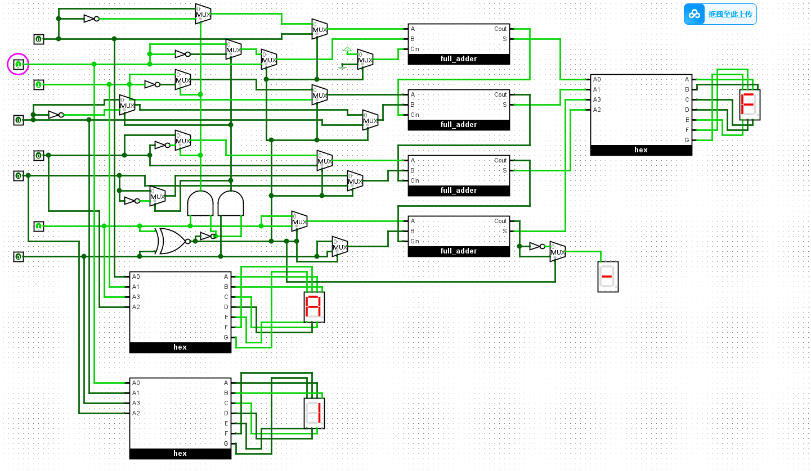

四位反码加法器
- 既然都用到RCA了，那么我们就尝试以相对简单的方式来处理
- 溢出的情况我们直接不考虑
- 对于全部为正数的情况，结果为正数，正常做就行了
- 对于全部为负数的情况，结果为负数，直接加一
- 对于符号各异，结果为正数，直接加一，结果为负数，不变

1010 (-5)    1010 (-5) 1010 (-5)
0010 (2)     0111 (7)  1110 (-1)

1100 (-3)    0001 (1)  1000 (-7)

按照这样的逻辑，我们可以得到

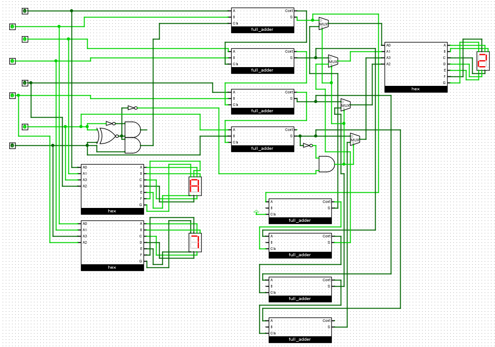